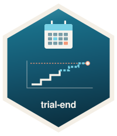
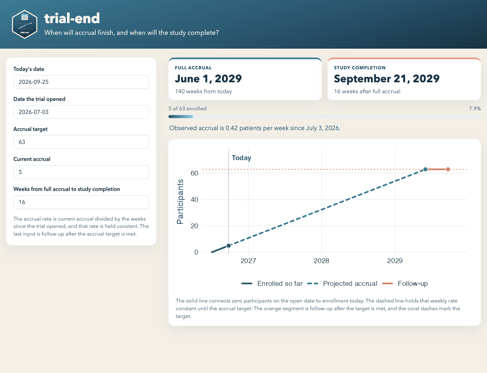

<h1>

trial-end
<br>
<br>
<br>
</h1>

Shiny app that projects when a clinical trial will reach its accrual target and when the study will complete, using enrollment observed so far.



The figure is the app in this repository, using its defaults on 25 September 2026: 5 of 63 participants enrolled over 12 weeks, with 16 weeks of follow-up after the accrual target.

Hosted copy: https://spakowiczlab.shinyapps.io/clinical-trial-end-date-predictor/

The source of the app is [`trial-end/app.R`](trial-end/app.R). That hosted path still uses the previous app name. Redeploy `trial-end` to refresh it.

## What it calculates

The app holds the accrual rate constant at the rate observed from the day the trial opened through today:

```text
weeks open              = (today − open date) / 7
patients per week       = current accrual / weeks open
weeks to full accrual   = ceiling((accrual target − current accrual) / patients per week)
date of full accrual    = today + weeks to full accrual
date of study completion = date of full accrual + weeks from full accrual to study completion
```

Weeks are rounded up, so the full-accrual date is the first week in which the target would be met. The last input is follow-up after that target is met (treatment and observation of the last patients required). Study completion is that many weeks after the projected full-accrual date.

Both dates are calendar dates. The app also prints the observed rate, how many participants are enrolled, and a curve of that same path: enrollment so far, the projection to the accrual target, and follow-up after the target is met.

### Worked example

Today is 25 September 2026, the trial opened 12 weeks earlier, 5 of 63 participants have enrolled, and the study continues 16 weeks after the accrual target is met.

- Rate = 5 / 12 ≈ 0.42 patients per week
- Weeks to full accrual = ceiling(58 / (5 / 12)) = 140
- Full accrual = 1 June 2029
- Study completion = 21 September 2029

Those are the values the app shows for its defaults on that calendar day.

## Inputs

| Input | Role |
| --- | --- |
| Today's date | Anchor for the projection. Change it to ask the question as of another day. |
| Date the trial opened | Start of accrual. Weeks open are counted from this date to today. |
| Accrual target | Participants required. |
| Current accrual | Participants enrolled as of today. Must be at least 1 and no greater than the target. |
| Weeks from full accrual to study completion | Follow-up after the accrual target is met. May be 0 when study completion and full accrual are the same date. |

## Run it locally

From this repository:

```r
install.packages(c("shiny", "lubridate", "ggplot2"))
shiny::runApp("trial-end")
```

## How invalid inputs are handled

The projection needs a positive amount of calendar time and at least one enrolled participant. Otherwise the rate is undefined and the previous version of the app still printed a date: opening day in, opening day out, it reported full accrual as today; zero enrollment produced a completion date in the year 5881637.

The app now stops and explains the problem when:

- the open date is today or in the future
- current accrual is below 1
- current accrual is already above the target
- the follow-up length is negative

Meeting the target exactly is allowed. Zero patients remain, so full accrual is today and study completion is today plus the follow-up length.

## Possible additions

The projection is one rate, one trial, and one pair of dates. Useful next steps, in roughly the order they would change a coordinator's week:

1. **A deadline check.** Enter an IRB, contract, or grant end date and show whether full accrual and study completion fall before it, plus the patients per week required to hit that deadline.
2. **An interval, not only a date.** Model enrollment as a count process (Poisson or negative binomial) and report a range of plausible full-accrual dates. The ceiling of the mean rate hides how noisy a small numerator is.
3. **Enrollment dates instead of a single total.** A startup lag, a paused site, or a recent surge is invisible when every week since opening is averaged together. A file of enrollment dates would let the rate be fit on a recent window.
4. **Site-level what-ifs.** Split the observed rate by site, then add or remove a site and recompute both dates. This is the question that usually follows "when will we finish?"
5. **Screen failures and replacements.** Keep enrolled, screen-failed, and evaluable counts separate so the target can mean evaluable participants while the rate is still estimated from everyone consented.
6. **Several trials on one page.** Same calculation, one row per study, for someone covering a portfolio.
7. **A one-page export.** Inputs, observed rate, weeks remaining, and both dates, for a trial meeting or an email to a sponsor.

## License

[MIT](LICENSE)
